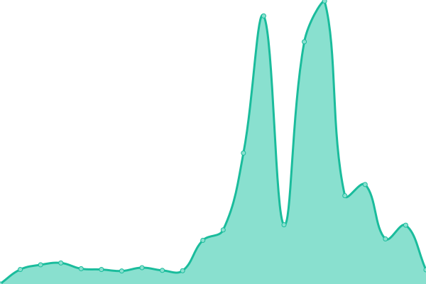

# [📈 Live Status](https://demo.upptime.js.org): <!--live status--> **🟧 Partial outage**

This repository contains the open-source uptime monitor and status page for [PeerConcept](https://demo.upptime.js.org), powered by [Upptime](https://github.com/upptime/upptime).

With [Upptime](https://upptime.js.org), you can get your own unlimited and free uptime monitor and status page, powered entirely by a GitHub repository. We use [Issues](https://github.com/peerconcept/uptime-monitor/issues) as incident reports, [Actions](https://github.com/peerconcept/uptime-monitor/actions) as uptime monitors, and [Pages](https://demo.upptime.js.org) for the status page.

<!--start: status pages-->
<!-- This summary is generated by Upptime (https://github.com/upptime/upptime) -->
<!-- Do not edit this manually, your changes will be overwritten -->
<!-- prettier-ignore -->
| URL | Status | History | Response Time | Uptime |
| --- | ------ | ------- | ------------- | ------ |
|  [Auction Forecast](https://auctionforecast.com) | 🟩 Up | [auction-forecast.yml](https://github.com/peerconcept/uptime-monitor/commits/HEAD/history/auction-forecast.yml) | 

 348ms
     
 | 

<a href="https://status.peerconcept.com/history/auction-forecast">18.69%</a>
    

|  [PeerConcept](https://peerconcept.com) | 🟩 Up | [peer-concept.yml](https://github.com/peerconcept/uptime-monitor/commits/HEAD/history/peer-concept.yml) | 

 244ms
     
 | 

<a href="https://status.peerconcept.com/history/peer-concept">100.00%</a>
    

|  [MKT staging](https://staging.mykidstales.com) | 🟥 Down | [mkt-staging.yml](https://github.com/peerconcept/uptime-monitor/commits/HEAD/history/mkt-staging.yml) | 

 1399ms
     
 | 

<a href="https://status.peerconcept.com/history/mkt-staging">97.99%</a>
    

|  [MKT prod](https://mykidstales.com) | 🟩 Up | [mkt-prod.yml](https://github.com/peerconcept/uptime-monitor/commits/HEAD/history/mkt-prod.yml) | 

 2482ms
     
 | 

<a href="https://status.peerconcept.com/history/mkt-prod">99.59%</a>
    

|  MKT API staging | 🟥 Down | [mkt-api-staging.yml](https://github.com/peerconcept/uptime-monitor/commits/HEAD/history/mkt-api-staging.yml) | 

 134ms
     
 | 

<a href="https://status.peerconcept.com/history/mkt-api-staging">98.09%</a>
    

|  MKT API prod | 🟩 Up | [mkt-api-prod.yml](https://github.com/peerconcept/uptime-monitor/commits/HEAD/history/mkt-api-prod.yml) | 

 130ms
     
 | 

<a href="https://status.peerconcept.com/history/mkt-api-prod">0.00%</a>
    

|  [Deep Future Analytics (production)](https://mgr.dfacecl.com/) | 🟩 Up | [deep-future-analytics-production.yml](https://github.com/peerconcept/uptime-monitor/commits/HEAD/history/deep-future-analytics-production.yml) | 

 422ms
     
 | 

<a href="https://status.peerconcept.com/history/deep-future-analytics-production">95.86%</a>
    

|  [Deep Future Analytics API (production)](https://mgr.dfacecl.com/api/v1/user/sign-in/) | 🟩 Up | [deep-future-analytics-api-production.yml](https://github.com/peerconcept/uptime-monitor/commits/HEAD/history/deep-future-analytics-api-production.yml) | 

 102ms
     
 | 

<a href="https://status.peerconcept.com/history/deep-future-analytics-api-production">99.03%</a>
    

<!--end: status pages-->

[**Visit our status website →**](https://demo.upptime.js.org)

## 📄 License

- Powered by: [Upptime](https://github.com/upptime/upptime)
- Code: [MIT](./LICENSE) © [Anand Chowdhary](https://anandchowdhary.com), supported by [Pabio](https://pabio.com)
- Data in the `./history` directory: [Open Database License](https://opendatacommons.org/licenses/odbl/1-0/)
