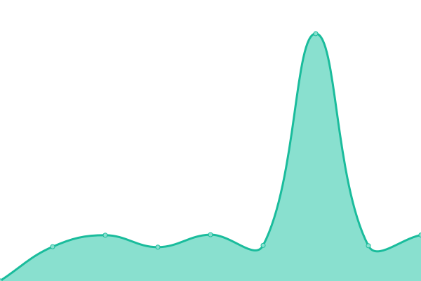
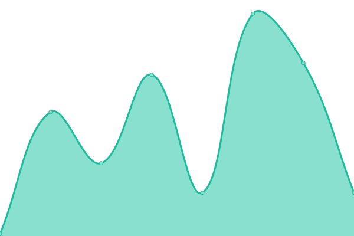

# [📈 Live Status](https://demo.upptime.js.org): <!--live status--> **🟧 Partial outage**

This repository contains the open-source uptime monitor and status page for [PeerConcept](https://demo.upptime.js.org), powered by [Upptime](https://github.com/upptime/upptime).

With [Upptime](https://upptime.js.org), you can get your own unlimited and free uptime monitor and status page, powered entirely by a GitHub repository. We use [Issues](https://github.com/peerconcept/uptime-monitor/issues) as incident reports, [Actions](https://github.com/peerconcept/uptime-monitor/actions) as uptime monitors, and [Pages](https://demo.upptime.js.org) for the status page.

<!--start: status pages-->
<!-- This summary is generated by Upptime (https://github.com/upptime/upptime) -->
<!-- Do not edit this manually, your changes will be overwritten -->
<!-- prettier-ignore -->
| URL | Status | History | Response Time | Uptime |
| --- | ------ | ------- | ------------- | ------ |
|  [Auction Forecast](https://auctionforecast.com) | 🟥 Down | [auction-forecast.yml](https://github.com/peerconcept/uptime-monitor/commits/HEAD/history/auction-forecast.yml) | 

 418ms
     
 | 

<a href="https://status.peerconcept.com/history/auction-forecast">79.82%</a>
    

|  [America's Cash Advance (production)](https://americascashadvanceinc.com) | 🟩 Up | [america-s-cash-advance-production.yml](https://github.com/peerconcept/uptime-monitor/commits/HEAD/history/america-s-cash-advance-production.yml) | 

 90ms
     
 | 

<a href="https://status.peerconcept.com/history/america-s-cash-advance-production">100.00%</a>
    

|  [Blue Mountain Loans (production)](https://bluemountainloans.com) | 🟩 Up | [blue-mountain-loans-production.yml](https://github.com/peerconcept/uptime-monitor/commits/HEAD/history/blue-mountain-loans-production.yml) | 

 87ms
     
 | 

<a href="https://status.peerconcept.com/history/blue-mountain-loans-production">100.00%</a>
    

|  [ClosingCostsLoans](https://closingcostsloans.com) | 🟩 Up | [closing-costs-loans.yml](https://github.com/peerconcept/uptime-monitor/commits/HEAD/history/closing-costs-loans.yml) | 

 583ms
     
 | 

<a href="https://status.peerconcept.com/history/closing-costs-loans">100.00%</a>
    

|  [MKT (production)](https://mykidstales.com) | 🟩 Up | [mkt-production.yml](https://github.com/peerconcept/uptime-monitor/commits/HEAD/history/mkt-production.yml) | 

 820ms
     
 | 

<a href="https://status.peerconcept.com/history/mkt-production">99.80%</a>
    

|  MKT API (production) | 🟩 Up | [mkt-api-production.yml](https://github.com/peerconcept/uptime-monitor/commits/HEAD/history/mkt-api-production.yml) | 

 143ms
     
 | 

<a href="https://status.peerconcept.com/history/mkt-api-production">100.00%</a>
    

|  [PeerConcept](https://peerconcept.com) | 🟩 Up | [peer-concept.yml](https://github.com/peerconcept/uptime-monitor/commits/HEAD/history/peer-concept.yml) | 

 249ms
     
 | 

<a href="https://status.peerconcept.com/history/peer-concept">100.00%</a>
    

|  [MKT (staging)](https://staging.mykidstales.com) | 🟩 Up | [mkt-staging.yml](https://github.com/peerconcept/uptime-monitor/commits/HEAD/history/mkt-staging.yml) | 

 548ms
     
 | 

<a href="https://status.peerconcept.com/history/mkt-staging">99.83%</a>
    

|  MKT API (staging) | 🟩 Up | [mkt-api-staging.yml](https://github.com/peerconcept/uptime-monitor/commits/HEAD/history/mkt-api-staging.yml) | 

 137ms
     
 | 

<a href="https://status.peerconcept.com/history/mkt-api-staging">99.83%</a>
    

|  [America's Cash Advance (staging)](https://aca1.staging.wpmudev.host/) | 🟩 Up | [america-s-cash-advance-staging.yml](https://github.com/peerconcept/uptime-monitor/commits/HEAD/history/america-s-cash-advance-staging.yml) | 

 182ms
     
 | 

<a href="https://status.peerconcept.com/history/america-s-cash-advance-staging">100.00%</a>
    

|  [Blue Mountain Loans (staging)](https://blueml.staging.tempurl.host/customer-details/?autoCreateUser=ACA) | 🟩 Up | [blue-mountain-loans-staging.yml](https://github.com/peerconcept/uptime-monitor/commits/HEAD/history/blue-mountain-loans-staging.yml) | 

 175ms
     
 | 

<a href="https://status.peerconcept.com/history/blue-mountain-loans-staging">100.00%</a>
    

|  [Deep Future Analytics (production)](https://mgr.dfacecl.com/) | 🟩 Up | [deep-future-analytics-production.yml](https://github.com/peerconcept/uptime-monitor/commits/HEAD/history/deep-future-analytics-production.yml) | 

 353ms
     
 | 

<a href="https://status.peerconcept.com/history/deep-future-analytics-production">100.00%</a>
    

|  [Deep Future Analytics API (production)](https://mgr.dfacecl.com/api/v1/user/sign-in/) | 🟩 Up | [deep-future-analytics-api-production.yml](https://github.com/peerconcept/uptime-monitor/commits/HEAD/history/deep-future-analytics-api-production.yml) | 

 74ms
     
 | 

<a href="https://status.peerconcept.com/history/deep-future-analytics-api-production">100.00%</a>
    

<!--end: status pages-->

[**Visit our status website →**](https://demo.upptime.js.org)

## 📄 License

- Powered by: [Upptime](https://github.com/upptime/upptime)
- Code: [MIT](./LICENSE) © [Anand Chowdhary](https://anandchowdhary.com), supported by [Pabio](https://pabio.com)
- Data in the `./history` directory: [Open Database License](https://opendatacommons.org/licenses/odbl/1-0/)
